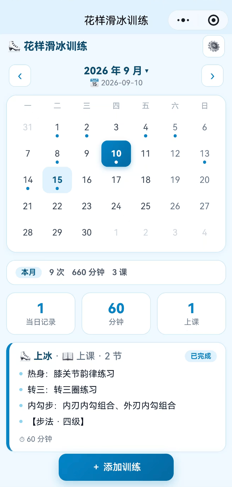
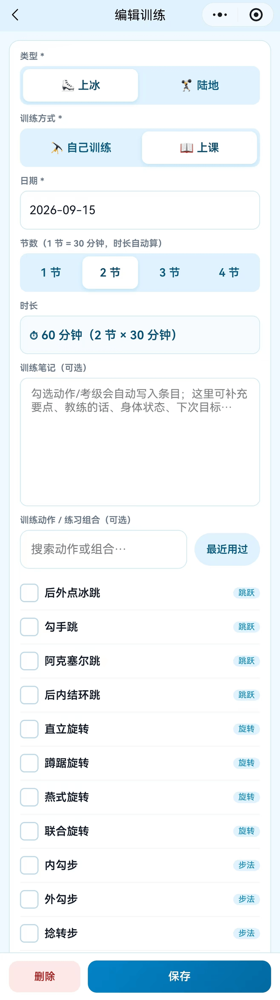
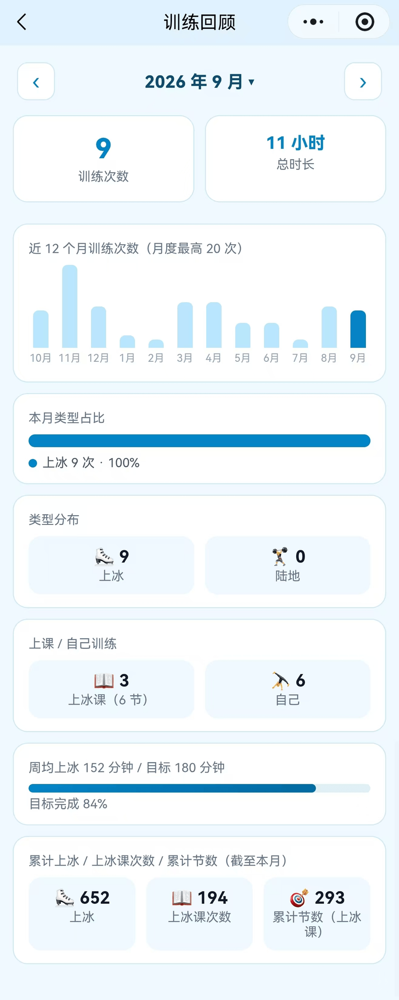
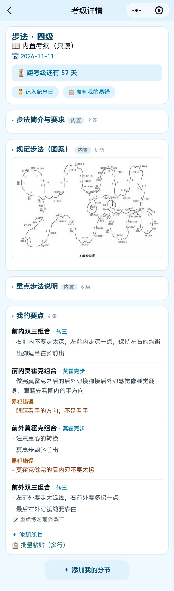
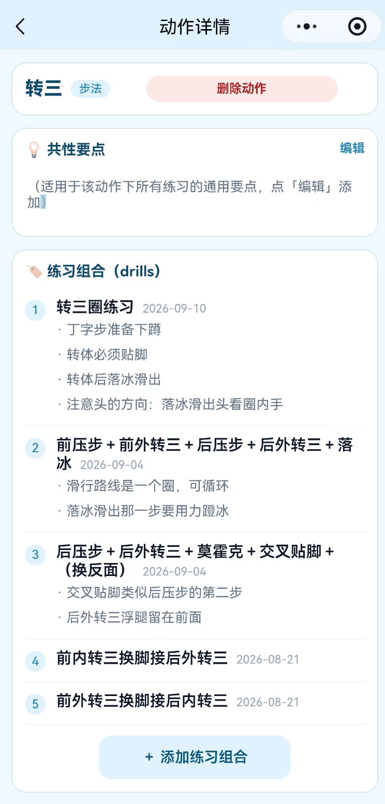
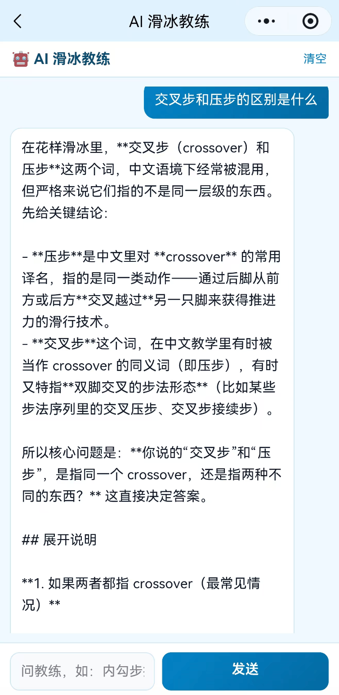
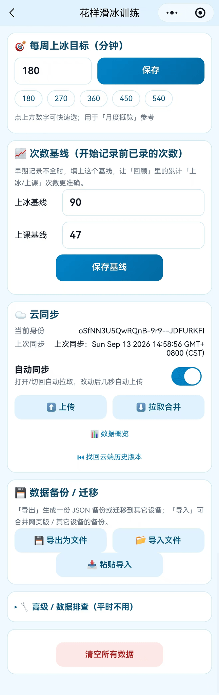
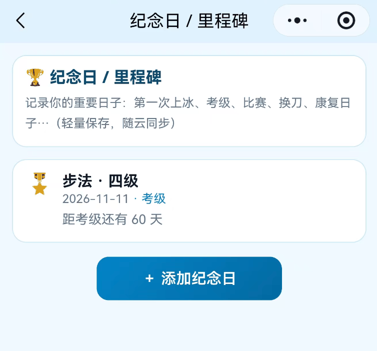

# 01 · 花样滑冰训练助手

> 一个我自己每天在用的训练工具。从纯前端 PWA 做到微信小程序，中间踩过的坑比功能本身更值钱。

---

## 起点：一个真实的、高频的、烦人的问题

我练花样滑冰。训练里有三件事一直很麻烦：

1. **教练在场是稀缺资源**——课上完了，动作细节就忘了
2. **训练记录靠记忆**——这周上冰几次、练了什么、进步在哪，说不清
3. **动作术语记不混**——内勾、外勾、转 3、括弧、捻转，名字和实际动作对不上

所以我决定自己做一个。**这是这个项目最重要的一个特点：我不是为了做项目而做项目，我是真的每天在用，所以每个功能都被真实需求筛过一遍。**

---

## v1 · 纯前端 PWA

**技术选择：单文件 `index.html` + Service Worker + localStorage，零依赖。**

```
pwa/
├── index.html          # 主程序（所有功能在一个文件里）
├── manifest.json       # PWA 配置
├── sw.js               # Service Worker，离线缓存
└── icons/              # 应用图标
```

**为什么是单文件**：这个工具只有我一个用户。引入构建工具、组件库、状态管理，只会让我每次改功能都要先跑一遍 `npm install`。**单文件意味着改完刷新就能用，迭代成本接近于零。**

**功能**：
- 月历记录（周一开头、今天高亮、可翻月）
- 训练记录：类型（上冰/陆地）、训练方式（自己/上课）、时长、内容、课后总结
- 每周上冰目标（分钟）
- 动作库与训练模板
- JSON 备份导出 / 导入恢复
- 可安装到主屏、离线使用

**踩过的坑**：
- **PWA 的"添加到主屏"在 `file://` 协议下不生效**——Service Worker 必须走 http(s)。所以必须起本地服务器或部署，不能双击 HTML
- **localStorage 会丢数据**：清浏览器数据、无痕模式、iOS 长期不用回收、存储空间满。所以我加了写入失败红色警示条 + 超过 30 天未备份提醒 + 一键导出备份
- **Service Worker 的缓存会让你改了代码看不到变化**——导航策略设成"网络优先"才解决

> 这三个坑教会我一件事：**"能跑"和"数据不丢"是两件完全不同的事。**本地存储的便利是有代价的，而代价必须靠产品设计（提醒、备份、警示）来还。

---

## v2 · 微信小程序

**为什么要做小程序**：PWA 在 iOS 上体验有限，而且我需要**手机和电脑共用一份数据**——PWA 的 localStorage 是单设备、不联网的。

```
miniprogram/
├── app.js / app.json / app.wxss
├── pages/
│   ├── index/        首页：月历 + 当日训练记录 + 快捷入口
│   ├── record/       添加/编辑/删除训练（动作搜索、"最近用过"、节数、拖动排序）
│   ├── moves/ move/  动作库 / 动作详情（共性要点 + 练习组合）
│   ├── review/       回顾（月度统计 + 12 个月趋势 + 类型占比 + 累计）
│   ├── coach/        AI 教练对话
│   ├── milestone/    里程碑 / 纪念日
│   └── settings/     设置与数据（目标、基线、云同步、备份、高级排查）
├── cloudfunctions/
│   ├── deepseek/     AI 教练（含知识库检索）
│   └── login/        openid 身份识别
├── packageExam/      考级备考（分包，按需预加载）
│   ├── exams/        考级列表（自由滑 / 步法，按级别）
│   └── exam/         考级详情（内置考纲、★我的要点/易错、内置步法图、倒计时）
└── utils/
    ├── const.js      常量、动作词典、内置考纲数据（SYLLABUS）
    ├── store.js      本地缓存与数据模型
    ├── sync.js       云端同步（体检 / 快照 / 合并策略）
    └── util.js       合并、备份、导入导出、倒计时
```

### 几个我真正做过的工程决策

**① 为什么 AI 调用必须走云函数**

小程序有**外域白名单**限制，前端直接调大模型 API 走不通，而且会被 CORS 拦住。解法是把调用放到微信云函数里。

这个决定顺带解决了一个更重要的安全问题：**API Key 只存在云函数的环境变量里，永远不进小程序包。**小程序包是可以被下载和反编译的，Key 放前端等于公开。

```
云函数 deepseek → 读取环境变量 DEEPSEEK_KEY → 调 DeepSeek API → 返回给小程序
```

**② 数据按 openid 隔离**

用微信云开发数据库，**按用户 `openid` 隔离数据**（单文档，1MB 内）。这样手机微信和电脑微信桌面版能共用同一份训练数据——这正是 PWA 版解决不了的问题。

同时这也满足隐私合规的"最小化收集"要求：我不需要用户注册账号，也不需要收集任何额外身份信息。

**③ 本地知识库检索 + 「官方优先 + 诚实」原则**

花滑动作术语容易混，纯靠模型记忆会胡说。我把转体类术语（内勾 / 外勾 / 转 3 / 括弧 / 捻转等）整理成本地知识库，在云函数里做检索增强。

更重要的是给模型定了一条原则：**官方资料优先；不确定的术语宁可说不知道，也不要编。** 因为花滑动作术语错了会直接导致训练受伤。

> 这条原则我觉得比技术实现更重要：**在一个用户会照着做的场景里，"不知道"是一个必须被允许的输出。**

**④ 双端数据互通**

PWA 和小程序是两套完全不同的存储，我用 **JSON 导出 / 导入按 id 合并去重**把两边打通——老数据不丢，可以平滑迁移。

**⑤ 自动同步不能把用户数据搞丢**

这一条是几个决策里我最在意的。自动同步听起来是个便利功能，但它有个危险的失败模式：**一台设备上数据不全时自动上传，会把云端完整的记录覆盖掉。**

我的处理：

- **自动同步默认开启**（开启后自动拉取，改动几秒后自动上传），但**上传前先做体检**——比较本机与云端的记录条数，如果本机明显更少，**自动上传直接跳过**，改成弹窗问用户"仍要上传？"
- **开发者工具不参与自动同步**，避免调试时误覆盖云端真实数据
- **导入 / 拉取前自动备份**本机数据，设置里可一键"恢复导入前"
- **合并而不是覆盖**：考级数据深合并（按条目并集）、`meta`（基线/每周目标）取大值合并——**基线不会被 0 覆盖**
- **云端保留最近 5 份历史快照**，出事可回滚
- 设置页提供**「同步诊断」**，直接看本机和云端各有什么

> 我的判断是：**自动化的价值不在于省几次点击，而在于它出错时不会毁掉东西。**一个会静默丢数据的自动同步，比手动同步糟糕得多。

**⑥ 六年数据怎么迁进来（和怎么验收）**

我 2020–2026 的训练记录原本是纯文本：一份 548 行的流水账（每行"日期 + 上课/自练"）、两份按日期分块的课堂笔记。

- **清洗**：剔除 11 条非滑冰记录（芭蕾 / 软开 / 基训 / 现代 / 身韵），混合行（如"自练101+芭蕾软开+基训"）保留并原样存档
- **对齐**：课堂笔记按日期并入同一天的记录；流水账里没有的日期（3 天）单独补录
- **建模**：上课记录带"节数"（我早期每次 1 节、2021 年后每次 2 节），时长自动 = 节数 × 30 分钟
- **对账**：用我笔记本里的累计编号当锚点，**反推每一次课的节数**——107 个锚点误差为 **0**，导入后"累计节数 **271**"与纸笔记录的"第 271 节"**完全一致**

> 数据迁移的验收标准不是"跑完了"，而是**能和原始记录对账**。差 1 节我都能发现——因为锚点在。

**⑦ 包体限制是硬约束**

主包一度到 **2.6MB** 直接上传失败（微信主包上限 2MB）：一张 1.9MB 的被误放进项目的头像图 + 一张 600KB 的扫描步法图。

- 把不该打包的图移出项目、把扫描图压到 **155KB**（灰度 + 缩放 + 优化）
- 把低频的**考级页做成分包** `packageExam`，首页 `preloadRule` 预加载
- 结果：**主包 119KB / 子包 187KB**，后面再加 10 级步法图也放得下

**⑧ 内置考纲只读 + 用户个性化覆盖**

考级大纲是官方内容，不该让用户去编辑，也不该随用户数据漂移。所以数据模型拆成两层：

- **考纲本体写在代码里**（`utils/const.js` 的 `SYLLABUS`，只读，随版本更新，带页码出处）
- **用户数据只存个性化部分**（某条考纲下的"★我的要点 / 易犯错误"、自建分节与条目、图片、考级日期）

好处是：考纲更新不用迁移用户数据，也不会出现"两份考纲打架"。

---

## 截图

<p>
  
  
  
</p>
<p>
  
  
  
</p>
<p>
  
  
</p>

（截图清单见 [`screenshots/`](screenshots/)。）

---

## 当前状态：两版都在正常运行，持续迭代中

**微信小程序已经完整跑通并在使用**——8 个主页面 + 1 个分包全部可用，云同步（含自动同步）和 AI 教练都已上线。

| 已实现并跑通 | 说明 |
|---|---|
| ✅ **月历 + 训练记录完整闭环** | 增删改查（`pages/record`）、按日期切换、当日统计 |
| ✅ **动作库与动作详情** | 动作级"共性要点" + 练习组合（各自要点、新增日期可改）+ 拖动排序 |
| ✅ **考级备考**（分包 `packageExam`） | 内置考纲（只读）+ ★我的要点/易错 + 内置步法图 + 距考级倒计时 + 一键记入纪念日；分节可折叠 |
| ✅ **训练记录里联动考级** | 勾选"几级步法/自由滑"即写入当天训练内容，可拖动调整顺序 |
| ✅ **节数体系** | 上课可选 1/2/3/4 节，时长自动 = 节数 × 30；自练时长选 60/90/120/150 分钟 |
| ✅ **回顾页** | 月度统计 + **近 12 个月趋势柱状** + 类型占比 + 累计上冰 / 上冰课次数 / **累计节数** |
| ✅ **里程碑时间线** | 手动记录（考级、比赛、第一次…），可长按或按钮删除 |
| ✅ **AI 教练对话页** | 接 DeepSeek 云函数，含本地知识库检索 |
| ✅ **设置与数据管理** | 目标、次数基线、云同步（自动同步开关 / 上传 / 拉取）、备份导出导入、**高级排查**折叠区 |
| ✅ **自动同步 + 数据安全** | 防覆盖体检、自动备份、深合并、云端 5 份历史快照可回滚 |
| ✅ **六年数据迁移** | 540 条记录 + 49 段课堂笔记，剔除非滑冰内容；累计节数与纸笔记录对账一致 |
| ✅ 隐私保护指引与最小化收集 | 数据按 openid 隔离，不收集额外身份信息 |

### 已知局限与下一步

| 项 | 现状 | 下一步 |
|---|---|---|
| **AI 知识库的来源** | 现有 5 份 ISU 资料是**中文翻译**，没有原文链接，且**赛季不统一**（2024-25 / 2025-26 / 2026-27 混用） | 给每条知识块加**来源元数据**（文号 / 赛季 / 页码 / 是否核对过），过季内容隔离，回答时声明"中译非原文"；补 ISU 官方英文 PDF 对照 |
| **考级大纲** | 已内置「步法 · 四级」（含步法图）；自由滑 1–10 级待录 | 逐级录入（用户提供书上原文/高清图），带页码可溯源 |
| **语音录入** | **已放弃**：原计划用微信官方「同声传译」插件，但**个人主体小程序无法使用该插件**，所以这条路线走不通 | 如仍需要，只能走"第三方 ASR + 云函数"（成本与隐私都要再评估） |
| **考级笔记进 AI** | 现在只能手动「复制我的易错」再粘给 AI | 让云函数按 openid 读取考级笔记 / 动作库要点，作为回答上下文 |
| 练习组合的"共性要点"统计 | 已能记录 | 按动作统计出现频率，提示长期没练的动作 |

**一句话**：这不是 demo，是一个我自己每天在用的产品。功能还会继续加，但**现在就能跑**。

> 说明：`packageExam` 放在分包里，是为了不拖慢主包加载——主包只保留高频路径，考级这类低频功能按需预加载。

---

## 如果只能看一处，看这里

`miniprogram/cloudfunctions/deepseek/` —— 里面有 API Key 的隔离方案和知识库检索的实现。
`miniprogram/utils/sync.js` —— 自动同步的防覆盖设计（体检 + 快照 + 合并策略）。
`miniprogram/utils/const.js` —— 内置考纲 `SYLLABUS`：只读内容与用户数据分层。
`pwa/index.html` —— 一个零依赖单文件应用能塞进多少东西。
